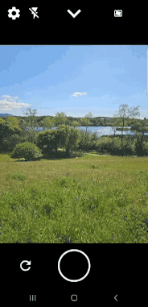

# Jetpack Camera App 📸

Jetpack Camera App (JCA) is a camera app, focused on features used by app developers, and built 
entirely with CameraX, Kotlin and Jetpack Compose. It follows Android 
design and development best practices and it's intended to be a useful reference for developers and
OEMs looking to validate their camera feature implementations.

# Development Environment ⚒️ 

This project uses the gradle build system, and can be imported directly into Android Studio.

Currently, Jetpack Camera App is built using the Android Gradle Plugin 8.10.0, which is only 
compatible with Android Studio Meerkat or newer.

## Pre-push Hook (Recommended)

This repository includes a `pre-push` hook that automatically checks your code for correct 
formatting using `spotless` before you push your changes. This helps prevent CI failures due to 
formatting issues.

To enable this hook, run the following command once from the root of the repository:

```bash
git config core.hooksPath scripts/git-hooks
```

This command configures Git to use the hooks located in the `scripts/git-hooks/` directory for this 
repository only. It will not affect your other Git projects.

### Bypassing the Hook

If you need to bypass the pre-push check for any reason, you can use the `--no-verify` flag with 
your push command:

```bash
git push origin <your-branch-name> --no-verify
```

# Architecture 📐

JCA is built with [modern android development (MAD)](https://developer.android.com/modern-android-development) principles in mind,
including [architecture and testing best practices](https://developer.android.com/topic/architecture).

The app is split into multiple modules, with a clear separation between the UI and data layers.

# Testing 🧪

Thorough testing is a key directive of JCA. We use [Compose Test](https://developer.android.com/develop/ui/compose/testing) and
[UI Automator](https://developer.android.com/training/testing/other-components/ui-automator) to write instrumentation
tests that run on-device.

These tests can be run on a connected device via Android Studio, or can be tested on an Android
Emulator using built-in Gradle Managed Device tasks. Currently, we include Pixel 2 (API 28) and
Pixel 8 (API 34) emulators which can be used to run instrumentation tests with:

`$ ./gradlew pixel2Api28StableDebugAndroidTest` and
`$ ./gradlew pixel8Api34StableDebugAndroidTest`

# Features ✨🧰✨

This section provides a detailed overview of the camera app's features, highlighting its 
capabilities and functionalities. Each feature is described with its purpose, usage, and any
relevant considerations to help you understand and utilize the app effectively.

- [Standard Camera Features](#standard-camera-features)
    * [Viewfinder](#viewfinder)
    * [Aspect Ratio](#aspect-ratio)
    * [Image Capture](#image-capture)
    * [Tap to Focus](#tap-to-focus)
    * [Flip Camera](#flip-camera)
    * [Zoom](#zoom)
    * [Scene Illumination / Flash](#scene-illumination---flash)
- [Video Features](#video-features)
    * [Video Capture](#video-capture)
    * [Pause / Resume](#pause---resume)
    * [Video Duration Limit](#video-duration-limit)
    * [Video Quality](#video-quality)
    * [Audio / Amplitude Visualization](#audio---amplitude-visualization)
    * [Frame Rate](#frame-rate)
    * [Video Stabilization](#video-stabilization)
    * [Flip Camera While Recording](#flip-camera-while-recording)
- [Advanced Camera Features](#advanced-camera-features)
    * [Screen Flash](#screen-flash)
    * [Dual Concurrent Camera](#dual-concurrent-camera)
    * [HDR (High Dynamic Range)](#hdr--high-dynamic-range-)
    * [LLB (Low Light Boost)](#llb--low-light-boost-)
    * [Single / Multi-stream Mode](#single---multi-stream-mode)
- [Special Application Features](#special-application-features)
    * [Debug Mode](#debug-mode)
    * [Intent Capture Modes](#intent-capture-modes)
    * [Dark Mode](#dark-mode)

## Standard Camera Features

This section outlines the essential features of the camera app that enable you to capture photos and
videos with ease. It covers fundamental aspects of camera operation, providing a solid starting
point for utilizing the app's capabilities.

### Viewfinder

The viewfinder provides a real-time preview of the camera's sensor output, accurately displaying the
scene with correct scaling and orientation. It functions as a "What You See Is What You Get" (
WYSIWYG) display, showing only the pixels that will be captured in the final image or video, when
hardware and processing capabilities allow (see limitations). This ensures that the displayed
preview precisely reflects the captured content, allowing for accurate composition and framing.

#### How to Enable / Use

* This is a core function of the camera app. When the camera app is opened, the viewfinder is
  active.

#### Constraints / Limitations

* The viewfinder's quality is limited by the screen's resolution and brightness. JCA is built on
  CameraX, which will limit the viewfinder resolution to 1080p as a tradeoff of performance and
  quality.
* Due to the computational demands of high-quality video stabilization, the viewfinder may not be
  strictly WYSIWYG when the video stabilization mode is set to “High Quality”, as the stabilization
  algorithm applied to the recorded video stream might not be able to be replicated in real-time for
  the viewfinder preview.

---

### Aspect Ratio

Sets the proportions of the preview and the captured image or video.

#### How to Enable / Use

1. Open the camera app settings and select Set Aspect Ratio
2. Or open the quick dropdown in the preview screen and look for the aspect ratio icon
3. Select/toggle among the desired aspect ratios (e.g., 16:9, 4:3, 1:1).

---

### Image Capture

Captures a still image from the camera. When the capture button is pressed, the camera captures a
still image that accurately represents the scene currently displayed in the viewfinder. The captured
image will incorporate any applicable image processing settings, such as Ultra HDR, based on the
user's selected mode.

#### How to Enable / Use

1. Open the camera app.
2. Tap the shutter button (white circle).
3. The resulting image is saved to the device's media store, or, when the app is launched via the
   `ACTION_IMAGE_CAPTURE` or `INTENT_ACTION_STILL_IMAGE_CAMERA` intents, to the URI(s) provided.

#### Constraints / Limitations

* The ability to capture an image may be limited by available device storage.
* Image capture is disabled when the app is launched with the `ACTION_VIDEO_CAPTURE` intent.
* Image capture is also disabled in concurrent camera mode and when HDR is enabled and the device
  does not support Ultra HDR image capture.

---

### Tap to Focus

Allows the user to manually select the focus point of the camera.

#### How to Enable / Use

1. Open the camera app.
2. Tap on the desired area of the viewfinder.
3. The camera will adjust the focus to the tapped area.

#### Constraints / Limitations

* May struggle in low-light conditions.
* Can be affected by movement of the subject or camera.
* Some devices may have limitations on how close or far the focus can be adjusted.

---

### Flip Camera

This feature allows users to instantly switch between the device's primary front-facing and
rear-facing cameras.

#### How to Enable / Use

There are several ways to flip camera lenses:

1. Open the camera app.
2. Tap the flip camera button.

Alternatively,

1. Open the camera app.
2. Double tap on the viewfinder.

Alternatively,

1. Open the camera app.
2. Open quick settings by tapping the downward facing arrow at the top of the screen.
3. Tap the flip camera button which is displaying the currently visible camera.

#### Constraints / Limitations

* If the device does not have a front or a rear camera, the flip camera button will be disabled.

---

### Zoom

This feature enables users to digitally or optically zoom in and out on the scene. On devices
equipped with Camera2's `LOGICAL_MULTI_CAMERA` capability, the zoom functionality may automatically
transition between available lenses, such as the main, telephoto, and wide-angle lenses, to provide
seamless zoom transitions across the device's optical range.

#### How to Enable / Use

1. Open the camera app.
2. Use pinch-to-zoom gestures. Text indicating the current magnification factor will appear above
   the capture button. If the device supports the `LOGICAL_MULTI_CAMERA` capability, switching
   between lenses will occur automatically as zoom increases or decreases.

#### Constraints / Limitations

* Digital zoom may reduce image quality.
* In Dual Concurrent Camera mode, only the primary lens’ zoom can be changed. The secondary lens
  will not react to pinch-to-zoom gestures.

---

### Scene Illumination / Flash

This feature provides various options for illuminating the scene during capture of images and video,
including:

* **On:** Activates the device's built-in flash for a burst of light during image capture, and
  constant illumination during video capture.
* **Auto:** Automatically determines the need for illumination based on ambient light conditions for
  image capture.
* **Low-Light Boost:** Utilizes Camera2's `ON_LOW_LIGHT_BOOST_BRIGHTNESS_PRIORITY` auto-exposure (
  AE) mode to enhance brightness in low-light conditions, if the device supports it.
* **Off:** Disables all scene illumination.

#### How to Enable / Use

1. Open the camera app.
2. Tap the flash icon to toggle between scene illumination modes (on, off, auto, LLB).
3. Take a photo or video.

Alternatively,

1. Open the camera app.
2. Open quick settings by tapping the downward facing arrow at the top of the screen.
3. Tap the flash icon to toggle between scene illumination modes.
4. Take a photo or video.

#### Constraints / Limitations

* Auto mode relies solely on ambient scene lighting for image capture and behaves as "On" for video
  capture.
* Dedicated front-facing flash units, if present, are not utilized; front-facing cameras exclusively
  use screen flash for illumination.
* Low-light boost may not be applied to image capture when the app is in multi-stream mode. To
  guarantee low-light boost application in both image and video capture, utilize single-stream mode.

## Video Features

This section explores the camera app's comprehensive video recording capabilities, providing tools
and settings to enhance your video capture experience. It covers various aspects of video
functionality, from basic recording to advanced controls and customization.

### Video Capture

Records video that, in most cases (see limitations), represents the scene visible in the viewfinder.
When HDR mode is enabled, the captured video can record 10-bit HDR content.

#### How to Enable / Use

1. Open the camera app.
2. Press and hold the shutter button (white circle) until video recording starts, indicated by a
   filled red circle in the shutter button and an incrementing duration timer above the shutter
   button.
3. Release the shutter button to finish recording. The resulting video is saved to the device's
   media store, or, when the app is launched via the `ACTION_VIDEO_CAPTURE` intent, to the URI
   provided.

#### Constraints / Limitations

* May be limited by device storage.
* Due to the computational demands of high-quality video stabilization, the viewfinder may not be
  strictly WYSIWYG when the video stabilization mode is set to “High Quality”. The stabilization
  algorithm applied to the recorded video stream might not be able to be replicated in real-time for
  the viewfinder preview.
* Video capture is disabled when the app is launched with the `ACTION_IMAGE_CAPTURE` or
  `INTENT_ACTION_STILL_IMAGE_CAMERA` intents.
* Video capture is also disabled when HDR is enabled and the device does not support 10-bit HDR
  video capture.

---

### Pause / Resume

Temporarily stops and restarts video recording.

#### How to Enable / Use

1. While recording video, tap the pause button.
2. Tap the resume button to continue recording.

#### Constraints / Limitations

* May not be available on all devices or in all recording modes.

---

### Video Duration Limit

Sets a maximum length for video recordings.

#### How to Enable / Use

1. Open the camera app settings.
2. Select Set Maximum Video Duration
3. Choose the desired duration limit.

---

### Video Quality

Sets the resolution and compression level of video recordings.

#### How to Enable / Use

1. Open the camera app settings.
2. Select Set Video Quality.
3. Choose the desired video quality (e.g., 720p, 1080p, 4K).

#### Constraints / Limitations

* Available quality settings depend on camera hardware.
* Ultra High Definition may only be available under video/image-only mode

---

### Audio / Amplitude Visualization

Controls the audio recording level and processing.

#### How to Enable / Use

1. Start video recording by holding down the capture button
2. Audio visualization appears to the right of the button while recording

---

### Frame Rate

Sets the number of frames recorded per second in a video.

#### How to Enable / Use

1. Open the camera app settings.
2. Select Set Frame Rate
3. Select the desired frame rate (e.g., 30fps, 60fps).

#### Constraints / Limitations

* Available frame rates depend on camera hardware.

---

### Video Stabilization

This feature offers multiple stabilization modes to enhance video smoothness and clarity. The
following stabilization modes are offered as options by JCA

* **Auto:** Automatically enables stabilization based on the device's capabilities and current
  recording settings.
* **On:** Activates stabilization for both the preview and recorded video streams, providing a
  smooth viewing experience during capture and playback.
* **High Quality:** Applies a high-quality stabilization algorithm to the recorded video stream,
  potentially resulting in superior stabilization. However, the preview stream may not be stabilized
  in real-time due to computational limitations.
* **Optical:** Utilizes the device's optical image stabilization (OIS) hardware to stabilize all
  streams.
* **Off:** Disables all stabilization features.

#### How to Enable / Use

1. Open the camera app settings from the settings icon in the upper left corner.
2. Click the “Set Video Stabilization” setting if it is selectable. If it is not selectable, the
   current lens does not support any video stabilization.
3. Choose the desired stabilization mode and press “close”. The stabilization mode will be applied
   when returning to the camera viewfinder. This selected stabilization mode will be persisted if
   the app is closed, and will be applied the next time the app is opened.

#### Constraints / Limitations

* Some stabilization modes, such as “On” and “High Quality”, may crop the video and/or viewfinder
  slightly.
* Each lens may support different stabilization modes. Supported stabilization modes will be
  selectable in settings, and unsupported stabilization modes will not be selectable. Swapping the
  default lens in settings may change the available stabilization modes.
* Some stabilization modes may not support every frame rate. To ensure best support for most
  stabilization modes, select “Auto” frame rate.
* If a stabilization mode is selected, and the camera switches settings via quick settings or by
  flipping cameras, the stabilization may be disabled temporarily. This is indicated by a greyed out
  stabilization icon at the top of the viewfinder screen. When settings and/or lens allow the
  stabilization mode, it will be re-enabled.

---

### Flip Camera While Recording

Switches between front and rear cameras during video recording.

#### How to Enable / Use

1. While recording video, tap the flip camera button.

#### Constraints / Limitations

* Uses Persistent Recording API which is experimental, and may not always function as expected
* May be buggy with pause/resume. This is being addressed.
* Does not work with concurrent cameras, stabilization, or single stream.

## Advanced Camera Features

This section delves into the advanced capabilities of the camera app, unlocking a new level of
control and creativity for experienced users. It explores features that extend beyond basic camera
operation, offering specialized functionalities and enhanced capture modes.

### Screen Flash

During image capture with a front-facing camera, this feature illuminates the subject by displaying
a solid, bright overlay on the device's screen and maximizing screen brightness.

#### How to Enable / Use

1. Open the camera app.
2. Ensure a front-facing camera is selected by tapping on the “flip camera” button.
3. Tap the flash icon to toggle between scene illumination mode. Screen flash will be selected if
   the “On” or “Auto” flash mode is selected.
4. Take a photo.

See the “Scene Illumination / Flash” feature for other methods of enabling screen flash.

#### Constraints / Limitations

* Screen flash will only be used for front-facing cameras.
* Screen flash is currently limited to image capture only. There will be no additional illumination
  for video capture.
* In "Auto" mode, screen flash behaves equivalently to the "On" mode, regardless of ambient scene
  lighting.

---

### Dual Concurrent Camera

This feature enables simultaneous video capture from both the front and rear-facing cameras. It is
built upon the CameraX concurrent camera APIs and is only available on devices that support the
`PackageManager.FEATURE_CAMERA_CONCURRENT` feature. The interface displays two video streams: a "
primary" stream and a "secondary" stream. The primary stream occupies the majority of the
viewfinder, providing the main view, while the secondary stream is presented in a picture-in-picture
format. The "Flip Camera" feature will swap the roles of the primary and secondary camera streams,
effectively switching which camera provides the main view.

#### How to Enable / Use

1. Open the camera app.
2. Open quick settings by tapping the downward facing arrow at the top of the screen.
3. Tap the concurrent camera mode button to select the concurrent camera mode. It will display
   “DUAL” underneath the button when Dual Concurrent Camera mode is enabled, and “SINGLE” for normal
   single-camera operation.
4. Both streams will be visible in the viewfinder. You may optionally record a video of what is
   visible in the viewfinder. Both streams will be composited in the recorded video.

#### Constraints / Limitations

* Image capture is not supported in dual concurrent camera mode; only video capture is available.
* Single-stream and multi-stream modes are unavailable; both camera streams are composited into a
  single output stream.
* HDR mode is not supported in dual concurrent camera mode.
* Zoom and tap-to-focus functionality are limited to the primary camera stream. Tapping on the
  secondary stream will interact with the corresponding area of the primary stream that is occluded
  by the secondary stream's view.
* Because two cameras are being used concurrently in Dual Concurrent Camera mode, additional power
  and thermal load should be expected.

---

### HDR (High Dynamic Range)

This multifaceted feature enhances the camera's ability to capture and display a wider range of
colors and brightness levels. It comprises three key components:

* **10-bit HDR Video Capture:** Record videos with enhanced color and dynamic range. This
  functionality is built upon CameraX's `DynamicRange` APIs, including the associated APIs within
  the `VideoCapture` class. 10-bit HDR allows for over a billion color possibilities, resulting in
  smoother gradients and more realistic color reproduction. High Dynamic Range (HDR) captures a
  wider range of light and dark tones, preserving detail in both highlights and shadows.
* **Ultra HDR Image Capture:** Capture images with expanded dynamic range by embedding a gain map
  within the standard JPEG file. This functionality is dependent on
  `ImageCapture.OUTPUT_FORMAT_JPEG_ULTRA_HDR` being an available output format on the device. This
  gain map stores supplemental luminance data, enabling compatible displays to render a wider range
  of brightness levels. On non-HDR displays, the image is rendered as a standard SDR JPEG, ensuring
  backward compatibility.
* **HDR Viewfinder Preview:** When 10-bit HDR video mode is activated, the device's display
  dynamically switches to HDR rendering for real-time preview, provided the current display supports
  the `ActivityInfo.COLOR_MODE_HDR` color mode. This enables accurate monitoring of captured HDR
  video content during recording, leveraging the display's extended dynamic range capabilities.

#### How to Enable / Use

1. Open the camera app.
2. Open quick settings by tapping the downward facing arrow at the top of the screen.
3. Tap the “HDR” button to select HDR mode, if it is enabled. Tapping again will toggle back to SDR
   mode.
4. Exit quick settings by tapping the upward facing arrow at the top of the screen.
5. Toggle between 10-bit HDR video mode and Ultra HDR image capture mode using the toggle switch in
   the lower right corner. If only one of these modes is available on the device, this switch will
   be disabled, and tapping it will display a reason for why it is disabled.
6. Take a photo or video as normal, depending on which mode is selected.

#### Constraints / Limitations

* Not every device supports HDR mode. Some devices may support only 10-bit HDR video or Ultra HDR,
  but not both.
* HDR mode supports either image capture or video capture, but not both simultaneously. Users must
  select their desired capture mode using the mode selector switch.
* HDR mode is not supported when using the dual concurrent camera feature.
* Different lenses on the device may have varying HDR capabilities. Some lenses may support HDR
  capture, while others may only support SDR capture.
* In HDR mode, single-stream mode is exclusively used for video capture. Image capture is disabled
  when single-stream mode is enabled.
* The viewfinder utilizes HDR rendering during 10-bit HDR video capture. However, HDR rendering may
  not be used in Ultra HDR image capture mode.
* During HDR preview, standard dynamic range (SDR) assets, such as the app's user interface, may
  appear dimmed.

---

### LLB (Low Light Boost)

Enhances the brightness of the camera's preview and recorded videos. If the device supports it, this
feature utilizes Camera2's `ON_LOW_LIGHT_BOOST_BRIGHTNESS_PRIORITY` auto-exposure (AE) mode to
improve brightness in low-light conditions.

#### How to Enable / Use

1. Tap the flash icon to cycle through flash modes.
2. The crescent moon icon indicates that LLB is enabled.
3. LLB has two states:
    1. Outlined Crescent Moon: LLB is inactive (the scene isn't dark enough).
    2. Filled Crescent Moon: LLB is active (the scene is dark enough, and brightness is enhanced).
4. To disable LLB, switch to a different flash mode.

#### Constraints / Limitations

* A reduced frame rate can introduce some motion blur.
* It only works on Preview and Video Capture in multi-stream mode.
* Images captured in single-stream mode will still be brightened.
* Not all devices support Low Light Boost. Only lenses with `ON_LOW_LIGHT_BOOST_BRIGHTNESS_PRIORITY`
  as an available `CONTROL_AE_AVAILABLE_MODES` support LLB.
* LLB will override the frame rate setting.

---

### Single / Multi-stream Mode

This setting controls whether the camera uses a single stream or multiple streams for preview,
video, and image capture.

* **Multi-stream mode:** Uses separate streams for preview, video recording, and still image
  capture. The output of each stream may appear slightly different. In general, this mode can be
  more efficient and have higher performance than single-stream mode.
* **Single-stream mode:** Uses a single stream for all functions. In this mode, the preview
  accurately reflects what will be captured in videos or images. This is a common mode that is used
  in apps that want to apply effects to the camera stream and have them appear in captured images
  and videos.

#### How to Enable / Use

1. Open quick settings by tapping the downward facing arrow at the top of the screen.
2. Tap the single or multi stream button. This will toggle between single stream or multi stream
   modes.

#### Constraints / Limitations

* Ultra HDR cannot be enabled in single stream mode.
* Multi or single stream selectors are not available when using Dual Concurrent Cameras.

## Special Application Features

This section explores features that provide extended functionality and customization within the
camera app, going beyond core image and video capture capabilities. These features cater to specific
user preferences and developer needs.

### Debug Mode

Provides advanced camera information and controls for developers.

#### How to Enable / Use

1. Launch the app with extra KEY_DEBUG_MODE set to true
2. Access the debug mode UI through the purple “Debug” button in the preview screen

#### Constraints / Limitations

* Intended for developers and may cause instability.

---

### Intent Capture Modes

Launch the app into modes with specialized user flow. Also allows configuring content values for
media to be captured

#### How to Enable / Use

1. In the launching intent for JCA, set intent action to ACTION_IMAGE_CAPTURE, ACTION_VIDEO_CAPTURE,
   or INTENT_ACTION_STILL_IMAGE_CAMERA for single image capture, single video capture, or multiple
   image capture mode.
2. Configure content values and insert the url into the intent at MediaStore.EXTRA_OUTPUT
3. Launch JCA

---

### Dark Mode

This feature allows users to customize the app's appearance by selecting between three modes:

* **On:** Enables dark mode, displaying UI elements with a darker color scheme.
* **Off:** Enables light mode, displaying UI elements with a lighter color scheme.
* **System:** Adopts the system-wide dark mode setting, dynamically adjusting the app's appearance
  based on the user's device preferences.

The appearance of UI elements will differ depending on the selected mode. This setting only affects
the user interface and does not impact the captured images or videos.

#### How to Enable / Use

1. Open the camera app settings from the settings icon in the upper left corner.
2. Tap the “Set Dark Mode” setting under “App Settings”.
3. Select the desired mode.

# Source Code Headers

Every file containing source code must include copyright and license
information. This includes any JS/CSS files that you might be serving out to
browsers. (This is to help well-intentioned people avoid accidental copying that
doesn't comply with the license.)

Apache header:

    Copyright (C) 2024 The Android Open Source Project

    Licensed under the Apache License, Version 2.0 (the "License");
    you may not use this file except in compliance with the License.
    You may obtain a copy of the License at

        https://www.apache.org/licenses/LICENSE-2.0

    Unless required by applicable law or agreed to in writing, software
    distributed under the License is distributed on an "AS IS" BASIS,
    WITHOUT WARRANTIES OR CONDITIONS OF ANY KIND, either express or implied.
    See the License for the specific language governing permissions and
    limitations under the License.
