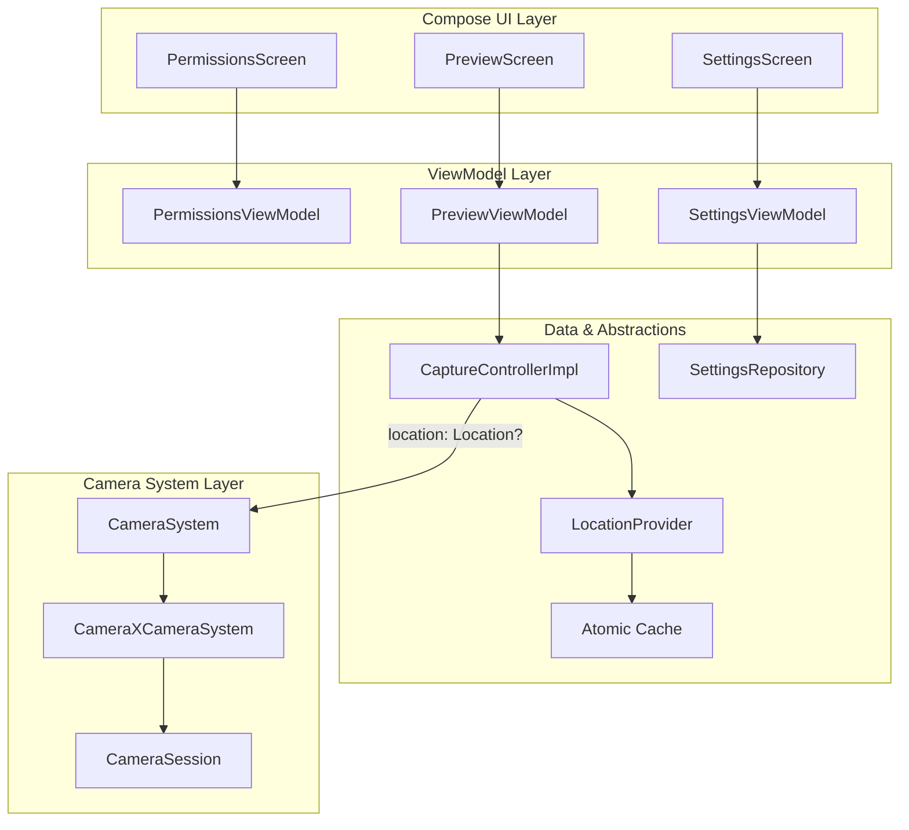

# JCA Location Integration Developer Guide

This guide details the implementation of geographic metadata (location tagging) for photos and videos in the Jetpack Camera App (JCA). It is designed to match the style of `developer.android.com` camera documentation and covers architecture, data flow, permissions, settings, and testing strategies.

## Overview

Modern smartphone users expect photo gallery organization, map views, and search by place. Adding location to captured media (EXIF tags for JPEG and ISO-6709 `udta` box for MP4) enables these experiences.

However, capturing location introduces challenges for a camera application:
*   **Zero Shutter Lag (ZSL):** Fetching location must not delay shutter response (must be <50ms).
*   **Battery & Thermal Conservation:** GPS streaming must only run when needed.
*   **Strict Privacy Guarantees:** Location access must respect user preferences and Android 12+ approximate/coarse limitations.

JCA implements a **Lifecycle-Aware Warmup Provider with Decoupled Capture Parameters** to overcome these challenges. Location coordinates are fetched asynchronously during viewfinder warmup and cached in-memory, ensuring zero overhead at the exact moment of capture.

## System Architecture and Data Flow

The camera layer is intentionally decoupled from location hardware, avoiding lifecycle dependencies.



### Data Flow Execution

1.  **Warmup Trigger:** When `PreviewScreen` enters the foreground, it signals `PreviewViewModel` to start location updates by checking if location is permitted and enabled via DataStore settings. `LocationProviderImpl` invokes `LocationManagerCompat`.
2.  **Caching:** As GNSS fixes arrive, they are cached in an `AtomicReference`. Once accuracy drops below 50 meters, active polling stops to conserve battery. Stale fixes (older than 30 minutes) are discarded.
3.  **Capture Tapped:** The user taps the shutter. `CaptureControllerImpl` synchronously reads the cache via `locationProvider.getCachedLocation()` (<1ms delay).
4.  **Metadata Injection:** The `Location?` parameter is passed downstream to `CameraSystem`. `CameraXCameraSystem` wraps it in `ImageCapture.Metadata()` or passes it through `VideoCaptureControlEvent.StartRecordingEvent` to `CameraSession`, which assigns it to `OutputOptions`.

## Runtime Permissions & Android 12+ Nuances

Android 12 (API level 31) introduced Approximate Location (Coarse). Users can grant `ACCESS_COARSE_LOCATION` without granting `ACCESS_FINE_LOCATION`.

### Dual Permission Request

JCA declares both permissions in `AndroidManifest.xml` and explicitly requests both together during onboarding to allow the OS to present the precise/approximate choice dynamically.

```xml
<uses-permission android:name="android.permission.ACCESS_FINE_LOCATION" />
<uses-permission android:name="android.permission.ACCESS_COARSE_LOCATION" />
```

### Dynamic Provider Fallback

If a user revokes `ACCESS_FINE_LOCATION` but leaves `ACCESS_COARSE_LOCATION` enabled, calling `LocationManager.requestLocationUpdates` with `GPS_PROVIDER` throws a `SecurityException`. JCA's `LocationProviderImpl` handles this safely by catching the exception and switching to `NETWORK_PROVIDER` or `FUSED_PROVIDER` automatically.

## Settings & Onboarding Flows

Location is an **opt-in** feature. It defaults to `false` in `CameraAppSettings` to respect privacy-by-default.

### Onboarding Queue

The location permission is represented by `PermissionEnum.LOCATION` with `isOptional = true`, meaning denying it will smoothly proceed to the next step, rather than continuously blocking camera access. Additionally, one `PermissionEnum` logically manages both the Fine and Coarse string manifestations to avoid duplicate UI screens.

### Settings On-Demand Prompt

If the user changes their mind and toggles "Save Location" in the `SettingsScreen`, the `SettingsViewModel` verifies the permission state. If ungranted, the UI triggers a runtime permission launcher. If granted, the `SettingsRepository` persists `locationEnabled = true` to DataStore via `updateLocationEnabled`.

## Testing Strategies

Testing location in a camera app requires isolated test doubles that avoid coupling to hardware.

### Testing with `FakeLocationProvider`

The `:core:location:testing` module provides `FakeLocationProvider`, an in-memory double.

```kotlin
// Example setup in testing
val fakeProvider = FakeLocationProvider()
fakeProvider.setLocation(latitude = 37.4220, longitude = -122.0841, accuracy = 10.0f)

// Validates passing fake coordinates down
captureController = CaptureControllerImpl(
    /* ... */
    locationProvider = fakeProvider
)
```

`FakeLocationProvider` populates synthetic `elapsedRealtimeNanos` and `time` automatically, enabling downstream validation without mocking `SystemClock`.

### Key Verification Focus

*   **Accuracy Thresholds:** Validating that fixes beyond 50m are rejected.
*   **Null Island:** Validating that (0.0, 0.0) is rejected.
*   **Stale Cache:** Validating fixes older than 30 minutes are discarded properly.
*   **Hardware Decoupling:** Verifying exactly that `CameraSystem` receives the location object unconditionally based *only* on `CaptureControllerImpl` outputs.
